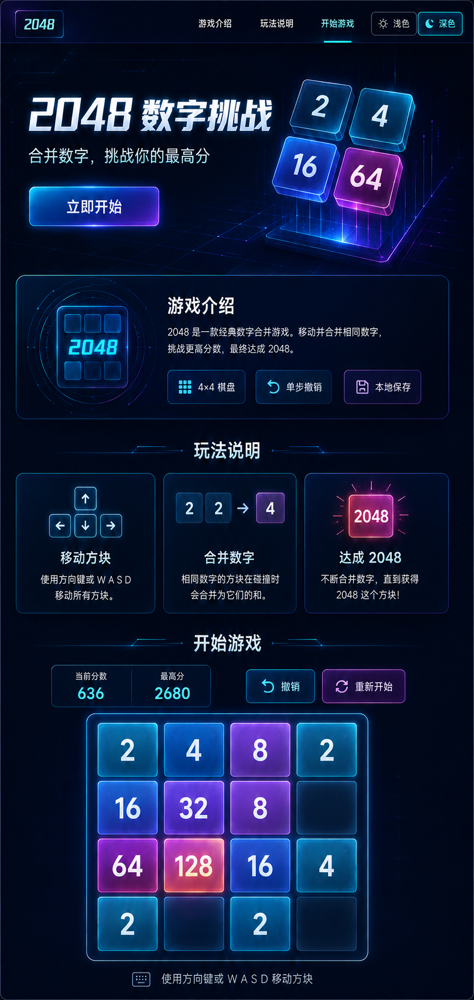
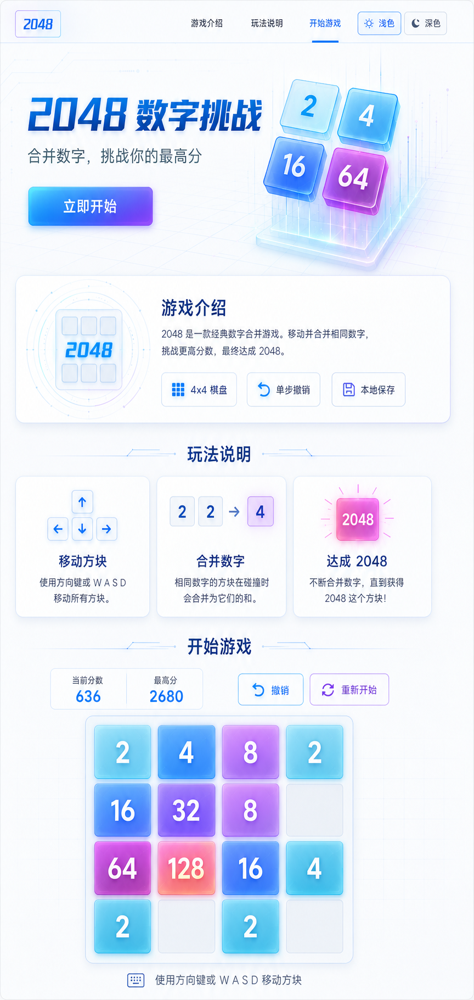

# 2048 网页版完整开发计划（含深浅主题原型）

## 1. 项目摘要与原型基准

开发一个纯前端、桌面优先的 2048 单机网页游戏。页面采用单页分区结构，依次展示：

1. 顶部导航与主题切换
2. 游戏主视觉
3. 游戏介绍
4. 玩法说明
5. 2048 游戏界面

以下两张工作区图片作为布局、组件、配色和视觉风格的开发参照：

### 深色科技主题原型



### 浅色科技主题原型



原型用于视觉参照，书面需求用于功能和交互判定；两者冲突时以本计划的书面规约为准。

## 2. 技术栈与项目结构

- React + TypeScript + Vite。
- 原生 CSS/CSS Modules，通过 CSS 自定义属性实现主题令牌。
- React `useReducer` 和自定义 Hook 管理游戏状态，不引入额外状态管理库。
- LocalStorage 保存棋局、最高分和主题偏好。
- Vitest 测试游戏引擎与状态转换。
- Playwright 测试键盘操作、主题切换、存档恢复和完整页面流程。
- ESLint、Prettier 和 TypeScript 严格模式保证代码质量。

```text
2048_web/
├─ projectPlan.md
├─ img/
│  ├─ 2048_dark_pic.png
│  └─ 2048_light_pic.png
├─ src/
│  ├─ app/App.tsx
│  ├─ components/
│  │  ├─ Header.tsx
│  │  ├─ ThemeSwitch.tsx
│  │  ├─ GameBoard.tsx
│  │  ├─ ScoreBoard.tsx
│  │  └─ GameDialog.tsx
│  ├─ sections/
│  │  ├─ HeroSection.tsx
│  │  ├─ Introduction.tsx
│  │  ├─ HowToPlay.tsx
│  │  └─ GameSection.tsx
│  ├─ game/
│  │  ├─ engine.ts
│  │  ├─ types.ts
│  │  ├─ storage.ts
│  │  └─ useGame.ts
│  ├─ theme/
│  │  ├─ theme.ts
│  │  └─ useTheme.ts
│  └─ styles/
│     ├─ tokens.css
│     ├─ themes.css
│     ├─ global.css
│     └─ animations.css
├─ e2e/
├─ index.html
└─ package.json
```

## 3. 页面与游戏需求

### 页面结构

- 顶部导航包含“游戏介绍”“玩法说明”“开始游戏”和主题切换控件。
- 点击导航项后平滑滚动到对应板块。
- 主视觉显示“2048 数字挑战”“合并数字，挑战你的最高分”和“立即开始”按钮。
- “立即开始”按钮滚动并聚焦游戏区域。

### 游戏介绍板块

- 必须作为独立板块展示在主视觉和玩法说明之间，不得只在主视觉中用一句话替代。
- 标题为“游戏介绍”。
- 介绍文案为：“2048 是一款经典数字合并游戏。移动并合并相同数字，挑战更高分数，最终达成 2048。”
- 展示“4×4 棋盘”“单步撤销”“本地保存”三个功能标签。
- 布局和图形表现分别参照深色、浅色主题原型。

### 玩法说明板块

- 使用三个卡片说明“移动方块”“合并数字”“达成 2048”。
- 显示方向键示意、`2 + 2 → 4` 合并示意和 2048 达成示意。
- 页面文案使用简体中文。

### 游戏功能

- 4×4 棋盘初始化时生成两个方块。
- 新方块中 `2` 的概率为 90%，`4` 的概率为 10%。
- 支持方向键和 `W/A/S/D`。
- 单次移动中每个方块最多合并一次。
- 只有有效移动才生成新方块、计分、更新存档和撤销快照。
- 达到 2048 后允许继续游戏或重新开始。
- 无空格且无法继续合并时显示游戏结束状态。
- 支持单步撤销、重新开始确认、当前分数和历史最高分。
- 刷新页面后恢复合法棋局；损坏存档自动忽略并初始化新棋局。

## 4. 深浅主题需求

### 主题切换控件

- 顶部导航右侧放置分段式主题控件。
- 包含太阳图标加“浅色”按钮、月亮图标加“深色”按钮。
- 当前主题按钮必须有明确的高亮、描边和 `aria-pressed="true"` 状态。
- 支持鼠标点击、Tab 聚焦以及 Enter/Space 键切换。
- 切换时页面背景、文字、卡片、棋盘、按钮、边框、阴影和装饰元素同步更新。
- 主题变化不影响游戏棋盘、分数、撤销记录或其他游戏状态。

### 主题初始化与保存

- 首次访问且没有保存偏好时，读取 `prefers-color-scheme` 选择初始主题。
- 用户点击主题按钮后，将明确选择保存到 `jy-2048:theme:v1`。
- 后续访问优先使用已保存主题，不再被系统主题覆盖。
- 页面加载阶段在 React 渲染前设置根节点 `data-theme`，避免短暂显示错误主题。
- 当前内部主题仅为 `"light"` 或 `"dark"`，界面不增加第三个“跟随系统”按钮。

### 视觉令牌

```ts
type ThemeMode = "light" | "dark";

interface ThemeState {
  mode: ThemeMode;
  source: "system" | "user";
}
```

```css
:root[data-theme="light"] {
  --color-bg: /* 冰蓝白背景 */;
  --color-surface: /* 白色玻璃面板 */;
  --color-text: /* 深蓝文字 */;
  --color-accent: /* 科技蓝 */;
  --color-accent-secondary: /* 紫色 */;
}

:root[data-theme="dark"] {
  --color-bg: /* 午夜蓝背景 */;
  --color-surface: /* 深蓝玻璃面板 */;
  --color-text: /* 冷白文字 */;
  --color-accent: /* 霓虹青 */;
  --color-accent-secondary: /* 电光紫 */;
}
```

- 所有组件只能使用语义化主题变量，不直接写死主题颜色。
- 深色主题参照午夜蓝、青色和紫色霓虹效果。
- 浅色主题参照冰蓝白、科技蓝和淡紫色效果。
- 数字块在两个主题中保持同一色阶语义，并确保数字与背景对比清晰。
- 科技感通过细网格、线路纹理、轻量辉光和玻璃面板体现，避免过度霓虹影响可读性。
- 在系统开启 `prefers-reduced-motion` 时关闭非必要发光和过渡动画。

## 5. 核心接口与数据规则

```ts
type Direction = "up" | "down" | "left" | "right";
type CellValue = 0 | number;
type Board = CellValue[][];

interface GameSnapshot {
  board: Board;
  score: number;
}

interface GameState extends GameSnapshot {
  bestScore: number;
  previous: GameSnapshot | null;
  status: "playing" | "won" | "continued" | "lost";
}

interface MoveResult {
  board: Board;
  scoreGained: number;
  moved: boolean;
  paths: TilePath[]; // 每个来源方块的坐标、目标坐标及合并标记
  merges: TileMerge[]; // 合并目标与两个来源身份
}
```

- 游戏引擎提供 `createInitialBoard`、`moveBoard`、`addRandomTile`、`canMove` 和 `hasWinningTile` 等纯函数。
- 游戏存档键为 `jy-2048:game:v1`，最高分键为 `jy-2048:best-score:v1`。
- 主题偏好独立存储，不与游戏存档合并。
- 存档读取必须校验棋盘尺寸、方块值、分数和状态。
- 不实现后端、账号、排行榜、云同步、移动端触控、PWA 或多人模式。

## 6. 实施顺序

1. 初始化 Vite React TypeScript 工程，并确认两张原型图片位于工作区 `img` 目录。
2. 建立语义化设计令牌、深浅主题样式和首屏主题初始化逻辑。
3. 实现顶部导航、主题切换、主视觉和独立游戏介绍板块。
4. 实现纯函数游戏引擎及单元测试。
5. 实现玩法说明、游戏棋盘、计分、撤销、胜负和重新开始。
6. 接入游戏存档、最高分和主题偏好。
7. 完成键盘可访问性、动画降级、跨浏览器测试和生产构建。
8. 在 README 中说明原型位置、主题令牌、测试和静态部署方式。

以上为基础版本实施顺序；后续界面优化按第 9 节分阶段执行，并同时满足第 7 节与第 9.6 节验收要求。

## 7. 测试与验收

- 验证游戏介绍板块独立存在，标题、文案和三个功能标签完整。
- 验证深色和浅色按钮均可点击及键盘触发，选中状态清晰。
- 验证首次访问按系统主题初始化，手动选择后刷新仍保持选择。
- 验证加载过程中不存在明显的主题闪烁。
- 验证切换主题不会重置棋盘、分数和撤销状态。
- 分别以深色、浅色主题执行 Playwright 全页截图测试，并与对应原型核对布局、色彩语义和组件层级。
- 验证文字和控件在两种主题下均具备足够对比度及可见焦点。
- 验证左右上下移动、连续压缩、合并限制、计分、撤销、胜利和失败逻辑。
- 验证无效移动不生成方块、不计分且不覆盖撤销快照。
- 验证合法存档恢复及非法存档回退。
- Chrome、Edge、Firefox 和 Safari 桌面版核心流程通过。
- 类型检查、Lint、单元测试、端到端测试和生产构建全部通过。

## 8. 默认约定

- 项目初始化时仅包含计划和原型图片；当前已有前端实现，后续在现有实现上增量改造，不重新初始化工程。
- 页面采用单页锚点导航，不引入 React Router。
- 验收桌面视口宽度不低于 1024px，主要截图基准为 1440px。
- 原型不是像素级强制复制，但页面结构、科技感方向、主题层次和组件位置应保持一致。
- 部署平台暂不限定，最终输出标准静态 `dist/` 文件。

## 9. 界面灵动性优化计划（2026-09-06 补充）

### 9.1 目标、范围与实施阶段

- 目标：增强操作与结果之间的视觉联系，改善棋盘手感和长页面浏览节奏，保持科技风格与可读性。
- 本节为优化规约。首轮与第二阶段中优先级优化已在用户确认后实施，实施情况和验收边界见第 9.7、9.8 节。
- 保留既定页面顺序、标题文案、功能标签、桌面尺寸规范、深浅主题、游戏规则和存储键。
- 首轮：棋盘动画、得分与纪录反馈、玩法动态演示、板块渐入；同步区分介绍与玩法卡片的视觉层次，并核对呼吸光强度。
- 第二阶段：导航位置高亮、方向按键联动、撤销提示、主题选中底板滑动。首屏鼠标视差继续作为低优先级可选项。
- 沿用 React、TypeScript、原生 CSS 与浏览器原生能力，默认不新增动画依赖。

### 9.2 首轮：棋盘操作与得分反馈

#### 方块滑动、合并和出生

- 有效移动时，方块从原位置沿输入方向滑向目标格；合并目标在滑动结束后轻微放大并回弹，新生成方块以短暂缩放出现。
- 未移动且未合并的方块保持稳定；无效移动不播放滑动、合并、出生和得分动画，也不改变棋局、存档及撤销快照。
- 动画必须表达真实移动路径，不能仅通过固定格子换数字、变色或整盘缩放模拟移动。
- 由纯逻辑计算生成可测试的来源坐标、目标坐标、合并关系及新方块位置；在 `game/types.ts` 明确相关类型，必要时扩展第 5 节移动结果接口。计算不得依赖 DOM 或动画完成事件。
- 渲染层区分固定棋盘底格与可移动数字块，维护单次移动所需的稳定身份，避免数字突然替换或重复残留。保持棋盘语义，装饰动画层不得重复播报数字。
- 动画数据属于临时呈现信息，不写入 LocalStorage；原有合法 v1 存档须继续兼容。恢复存档直接展示最终棋局，不重播旧移动。
- 快速连续输入按顺序基于最新逻辑状态处理；动画未完成时可收束上一段呈现并衔接下一步，不因动画锁丢弃输入或无限排队，不重复计分、合并或生成随机块。
- 撤销、重开时清理旧动画及回调，呈现对应状态，不把撤销识别成新合并。胜负对话框应与最终棋盘一致，减少动态效果模式下不得依赖动画事件才能打开。

#### 得分与突破纪录

- 每次产生合并得分时，在当前分数附近显示本次真实增量，如 `+8`、`+32`，短暂上浮后消失；总分立即准确更新。
- 快速连续得分时替换为最新一次增量，避免文字堆叠；无得分移动、撤销、重开、恢复存档和主题切换不触发正向加分提示。
- 以本局开始或恢复时的历史最高分为基准，本局第一次严格超过该基准时显示一次“新纪录”并轻量点亮；后续加分不重复庆祝。
- 新局重新记录基准；存档恢复本身不触发庆祝；撤销后再次超过基准不重复触发本局已展示的提示。历史最高分仍按既有规则保存。

### 9.3 首轮：玩法演示与页面节奏

#### 玩法动态演示

- “移动方块”：方向键示意短暂亮起，小型示意棋盘中的方块向同一方向移动一次。
- “合并数字”：两个 `2` 靠拢并合成 `4`，播放结束后保留清晰的 `2 + 2 → 4` 规则示意。
- “达成 2048”：2048 方块轻微放大并点亮一次，结束后回到静态状态。
- 每张卡片首次进入视口时自动播放一次，提供具有明确可访问名称的“重播演示”按钮，支持鼠标和键盘；不无限循环，不劫持真实游戏方向键。
- 演示使用独立固定数据，不改变真实棋盘、得分、撤销记录或存档。离开视口时停止演示并呈现静态结果，再次滚入不自动重播。
- 保留现有文字说明；减少动态效果模式下直接显示可理解的静态示意，重播也不恢复位移或闪光动画。

#### 板块渐入与卡片层次

- 游戏介绍、玩法说明及游戏区域首次进入视口时，标题先淡入，卡片或主要面板按阅读顺序小幅上移并淡入；均只播放一次。
- 使用 `IntersectionObserver` 检测进入视口；内容默认可见，不支持观察器或启用减少动态效果时直接显示完整内容。
- 锚点导航到达、键盘焦点进入板块时，相关内容应立即可见，不等待渐入完成；保留平滑滚动及合理焦点行为。
- 介绍卡片保持简洁的图标与文字表达，玩法卡片突出动态示意和步骤编号；保留桌面三列等宽、24px 列间距及至少 24px 内边距。
- 首屏已有漂浮与呼吸光，实施前应核对深浅主题实际亮度。此前源码检查发现基础透明度为 `0.16`，呼吸关键帧为 `0.55–0.9`；此为待视觉验证项，不作为已确认的视觉缺陷。
- 如需调整光晕，将基础与峰值强度统一为主题令牌，避免关键帧覆盖为过强亮度，确保文字、按钮与棋盘清晰。

### 9.4 后续可选优化

| 优先级 | 优化项 | 交互细节与完成标准 |
| --- | --- | --- |
| 中 | 导航跟随位置 | 以固定导航下方的阅读参考线确定当前板块，对应导航高亮或显示短下划线，并设置 `aria-current="location"`；多个板块同时可见时仅标记一个，首屏可不标记，滚动不移动键盘焦点。 |
| 中 | 方向按键联动 | 游戏接收方向键或 W/A/S/D 时，同步点亮对应方向按钮并呈现短暂按下效果；鼠标按下有同等反馈，不把无效移动显示为合并成功，窗口失焦后清除按下状态。 |
| 中 | 撤销反馈 | 撤销成功后显示短暂“已撤销”提示，不移动焦点、不遮挡棋盘；无撤销记录时按钮继续禁用。 |
| 中 | 主题选中底板 | 选中底板在深浅选项之间短距离滑动，页面颜色平稳切换；保持高亮、描边、`aria-pressed` 和键盘操作，切换不重播游戏与入场动画。 |
| 低 | 首屏鼠标视差 | 仅首屏装饰方块随鼠标小幅偏移，指针离开后复位；与已有漂浮使用分层变换，避免相互覆盖。仅精细指针设备启用，离屏及减少动态效果时关闭，不移动正文与按钮。 |

### 9.5 动效基准、性能与无障碍

以下为实现的初始调校基准，实际观感需在深浅主题验证；调整范围应保持在本节约束内。

| 动效 | 初始时长与幅度 |
| --- | --- |
| 方块滑动 | 100–150ms，沿真实格子距离平移 |
| 合并回弹 | 120–180ms，最大缩放约 1.08 |
| 新方块出现 | 100–150ms，从约 0.8 缩放到 1 |
| 加分提示 | 500–700ms，上浮 12–20px 后消失 |
| 玩法单次演示 | 1–2s，结束后保持静态，不循环 |
| 板块渐入 | 300–450ms，上移 12–20px；同组元素错开 60–90ms |
| 控件反馈与主题底板 | 120–200ms，按钮按下位移不超过 2px |
| 可选首屏视差 | 最大偏移 4–8px |

- 时长、缓动、位移、缩放及光晕强度使用共享 CSS 自定义属性；通用动效与降级放在 `animations.css`，局部样式使用 CSS Modules。
- 动画以 `transform` 和 `opacity` 为主，不在每帧修改布局尺寸，不持续动画大面积模糊或阴影；不得产生布局跳动、水平滚动或遮挡控件。
- 页面隐藏或装饰离开视口时暂停持续动画，卸载时清理观察器、事件监听、计时器及动画帧。
- `prefers-reduced-motion: reduce` 下关闭漂浮、呼吸、滑动、回弹、渐入和视差，直接呈现最终状态；加分、纪录、撤销等信息可静态短暂显示，游戏逻辑与全部控件仍可正常工作。
- 动态信息不得仅靠颜色表达；必要状态使用克制的 `aria-live="polite"` 提示，避免连续操作时重复播报。无焦点抢占、闪烁和整盘震动。

### 9.6 改造顺序与验收

1. 核对现有实现和深浅主题页面，确认本次执行首轮或哪些可选项，建立共享动效令牌。
2. 实现并测试移动路径、合并关系与新方块信息，再接入棋盘动画及快速输入处理。
3. 接入加分与纪录反馈，验证撤销、重开、存档恢复及主题切换边界。
4. 实现独立玩法演示、重播与板块渐入，区分卡片层次并核对呼吸光。
5. 完成减少动态效果、键盘与性能检查；如本次包含可选项，再按第 9.4 节逐项执行。
6. 按以下新增要求和第 7 节完成验收，在交付中分别注明已实现、未实现及未验证项。

- Vitest：验证四方向的移动来源与目标、多组合并、单次最多合并一次、新方块信息与实际棋局一致；覆盖连续输入、无效移动及原有 Reducer 和存档规则。
- Playwright：验证有效移动的滑动、合并、出生反馈与最终棋盘一致；快速连续输入后无残留、无重复计分；动画中撤销、重开、切换主题后状态正确。
- 验证有得分与无得分移动、纪录首次突破、连续突破、撤销后再次突破、刷新恢复和新局的提示触发规则。
- 验证玩法演示与真实棋局隔离、首次可见播放、离屏停止、键盘重播；渐入只播放一次，锚点和键盘导航可立即看到目标内容。
- 模拟减少动态效果：所有必要内容立即可见，移动与胜负流程正常，静态提示完整，不等待动画结束事件。
- 在 1440px 主视口及 1024px 验收下限分别核对深浅主题，检查动画过程与结束状态、卡片层次、数字清晰度、焦点样式、光晕强度和布局稳定性；较窄视口仍不得横向溢出或遮挡。
- 截图在确定的静态或动画结束状态采集，另通过浏览器交互核对动效过程，不能仅凭静态截图判定滑动动画完成。
- 代码改造交付前通过 TypeScript、ESLint、Prettier、Vitest、Playwright 和 Vite 生产构建，并按第 7 节核对浏览器兼容性；环境受限项必须明确列出，不得记为通过。

### 9.7 首轮实施记录（2026-09-06）

- 已实现：真实路径滑动、合并回弹和出生效果；增量得分、本局首次突破纪录提示；三种独立玩法演示、首次可见播放和键盘重播；板块单次渐入、导航与焦点立即显示；介绍与玩法卡片层次区分。
- 引擎新增 `spawnRandomTile` 返回棋盘及出生坐标；`MoveResult` 提供 `paths` 和 `merges`。`GameSession` 将临时呈现与持久化 `GameState` 分离，旧 v1 存档继续兼容，不保存动画、纪录庆祝或时间信息。
- 连续操作由 Reducer 按最新逻辑状态顺序计算；每个 Action 携带预采样随机值，避免 StrictMode 重算导致随机结果不一致。呈现层允许结束上一段动画后接续新输入，不锁键或排队等待动画。
- 动效令牌位于 `tokens.css`，全局关键帧通过共享变量引用，避免 CSS Modules 重命名后失效。呼吸光基础/峰值：浅色 `0.16/0.24`，深色 `0.12/0.20`；已核对峰值和静态页面可读性。
- 已处理：撤销/重开清理旧动效、减少动态效果直接展示最终棋局、离屏与页面隐藏暂停持续装饰、对话框键盘焦点及返回触发控件、WebKit 棋盘高度差异。
- 验收结果、命令及环境限制见 README 的“优化验收”。浏览器截图保存在 Playwright `test-results/`；截图核对与动画阶段的浏览器断言共同验证呈现效果。
- 第二阶段已继续实施第 9.4 节四项中优先级优化；低优先级首屏鼠标视差仍未实施。

### 9.8 第二阶段实施记录（2026-09-06）

- 导航以固定导航高度加 24px 的阅读参考线计算当前板块，首屏不强制标记；“游戏介绍”“玩法说明”“开始游戏”最多一个具有短下划线与 `aria-current="location"`，滚动监听经动画帧合并且不操作焦点。
- 方向键、W/A/S/D 和鼠标方向按钮共用短暂按下反馈；有效与无效输入均只表达按键动作，不把无效移动呈现为合并成功。窗口失焦会清除状态，减少动态效果时不播放按下位移。
- 仅成功撤销后在控制区固定高度槽位显示短暂“已撤销”，使用 `role="status"` 和 `aria-live="polite"`，不抢占焦点或遮挡棋盘；无快照时撤销按钮继续禁用。
- 主题控件增加位于按钮下层的滑动选中底板，保留当前项描边、文字高亮、`aria-pressed`、Tab/Enter/Space 操作。主题切换仍独立存储，不影响棋局、撤销记录与页面入场状态。
- 本阶段未增加依赖或变更 LocalStorage 键。验收结果、命令和浏览器环境限制见 README 的“优化验收”；低优先级首屏鼠标视差未实施。
